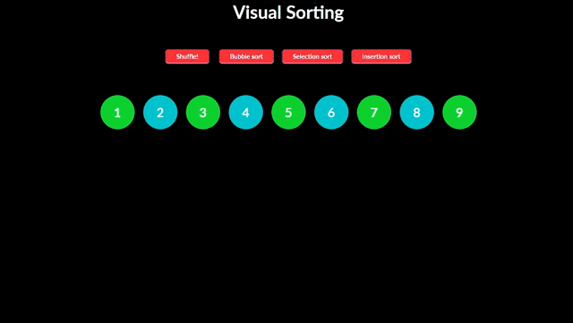

# VueJS-Sorting-Algorithms

  Displays 9 numbers in an array  
  Four functions provided  
 <ul>
   <li>Shuffle</li>
   <li>BubbleSort</li>
   <li>SelectionSort </li>
   <li>InsertionSort </li>
 </ul>
 User can shuffle the numbers and then select the kind of sort they want to implement  
 and watch the sorting process happen in front of them.

Updated: March 14, 2021

